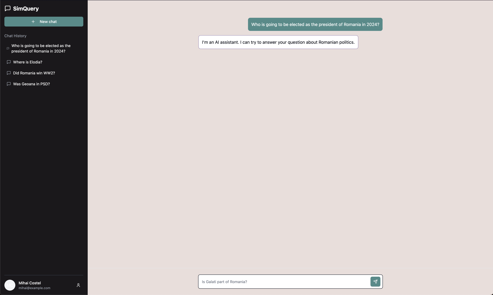

# SimQuery

**SimQuery** is a Next.js-based AI application for validating data about Romanian political history. It cross-references and verifies data points like historical events, political figures, and key dates, ensuring accuracy and reliability for research and educational purposes.



---

## Project Overview

SimQuery provides tools to validate data related to Romania’s political history, using AI to analyze and cross-reference input data with known historical records. Built with Next.js, SimQuery is optimized for fast, seamless interactions and accurate validation results.

---

## Features

- **Historical Event Validation**: Verifies dates, events, and political figures in Romanian history.
- **Cross-Referencing**: Cross-references data points with a verified historical database.
- **Easy-to-Use Interface**: Built with Next.js for a smooth, responsive user experience.

---

## Installation

1. Clone the repository:

   ```bash
   git clone https://github.com/yourusername/simquery.git
   cd simquery
   ```

2. Install dependencies:

   ```bash
   npm install
   ```

3. Run the development server:

   ```bash
   npm run dev
   ```

   Open [http://localhost:3000](http://localhost:3000) to view it in your browser.

---

## Usage

To start using **SimQuery**, upload or enter data about Romanian political history for validation. Results will show validated data points and any discrepancies found.

---

## Contributing

Feel free to submit issues or contribute with pull requests to improve **SimQuery**.

---

## License

This project is licensed under the MIT License.

---

Enjoy using **SimQuery** to validate your historical data accurately and efficiently!
